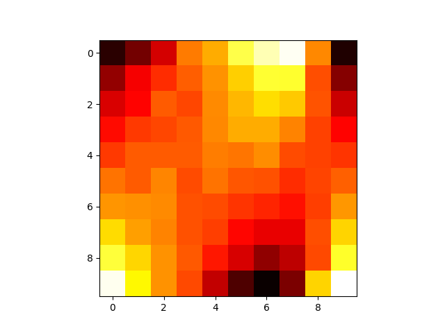

# Blotto - Jane Street Game

### Rules
- There are 10 battlefields, numbered 1, 2, 3, ... , 10 and worth 1, 2, 3, ... , 10 points respectively.
- You have 100 soldiers, which you can allocate between the battlefields however you wish.
- Your opponent also (independently) does the same.
- The number of soldiers on each battlefield is then compared, and for each battlefield, whoever has the most soldiers on that field wins it's points.
- In the case of a tie, no one get's points.
- In a given match, battlefields are fought in order (starting with battlefield 1), and as soon as one player reaches a score of 20 or more points, the match ends. Any remaining battlefields go unawarded.

### Solution
My Submission is [4, 2, 9, 8, 2, 14, 31, 29, 0, 1].

TLDR: This solution was arrived at after coding up a genetic algorithm and running about 5 billion games on some Nvidia GPUs.

Originally, I coded up the game and––to see what types of strategies are generally better than others––I generated about 10,000 random allocations and had them play in a round robin tournament. (Notably, there are ~4.3 trillion possible configurations, so simulating them all is computationally intractable. If each game takes about 100 bytes to store, storing all configurations would take about 430 terabytes.)

I then ranked the 10,000 strategies and produced this visualization:

The horizontal axis represents the individual castles where soldiers can be placed. The vertical axis represents the ranked strategies divided into deciles with best strategies on top and worst on the bottom. Lighter squares represent more soldiers, and darker squares represent fewer soldiers. You can see that the worst performing strategies place many soldiers on the first castles where they are awarded few points and on the last castles where their opponent defeats them before these soldiers are ever useful. The best strategies seem to try to win on castles 6, 7, and 8 (at least when playing random players).

Next, it was clear to me that players of this game would not be submitting random strategies. I needed to create a dataset of valid and diverse strategies to generate my own effective submission. I decided that the bottom 50% of strategies from those generated from above would never be played, so I deleted them. Instead I decided to replace them with mutated versions of the top 50% of strategies. My mutate function took 5 castles and added 1 soldier to them and removed a soldier from the other 5 castles. In this way, if this were a convex optimization problem, we are removing the strategies furthest away from optimal, retaining the 50% that are closest and generating new data which is close to our approximated optimal solution region but with noise which will let us approach new optimums.

With this mutation function in hand, I ran generated 100,000 random allocations (for maximum diversity) and played 1,000 round robin tournaments while evolving the dataset each time. This ensured that I was only playing against the best performers in a way that might mimic other Jane Street interns' submissions. I'm grateful to have access to extra GPU's because a single round robin with 100,000 players is ~5,000,000 games, so in total I had to simulate ~5 billion games.

Finally, after running the simulations, I had my results. However, stopping after 1,000 iterations seemed a little arbitrary to me, and I noticed some fluctuations in strategies. Therefore, I considered the winner after each round to be an equally valid submission and played one final round robin with all of those winners which revealed my final answer of [4, 2, 9, 8, 2, 14, 31, 29, 0, 1].

I'm so curious to see what kind of results people submit and which submissions are most successful. This game has been such an interesting mix of game theory and optimization. Thanks for a great contest!
